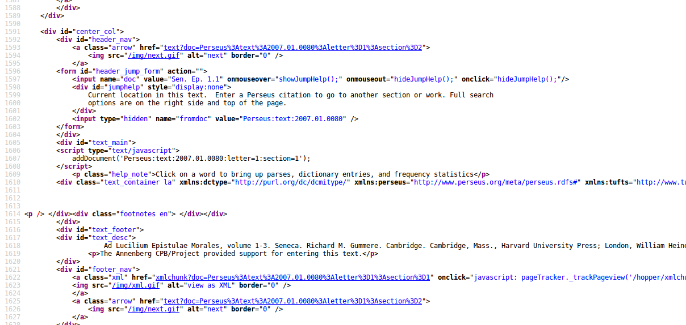
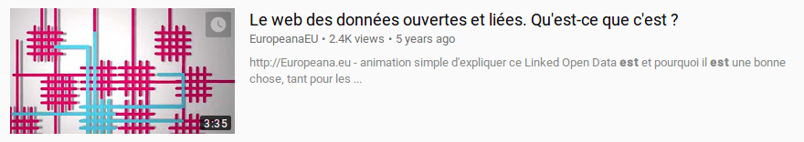

<!-- $theme: default -->
<!-- $size: 16:9 -->

Introduction aux Linked Open Data
=================================

<small>Thibault Clérice, 
Responsable pédagogique du Master TNAH,
thibault.clerice@chartes.psl.eu</small>

<small><small>D'après Blaney Jonathan, *Introduction to the Principles of Linked Open Data*, ProgrammingHistorian.org, eds. Adam Crymble</small></small>

---

# Linked Open Data ?

> Les LOD sont des informations structurées écrites dans un format pensé pour les machines, et pour cette raison ne sont pas nécessairement très agréables pour l'oeil humain.

Blaney Jonathan, https://programminghistorian.org/lessons/intro-to-linked-data

---

## Le web tel qu'on le voit

### Sénèque et les *Lettres à Lucilius*

Sénèque : https://fr.wikipedia.org/wiki/S%C3%A9n%C3%A8que
Sur BNF : http://gallica.bnf.fr/ark:/12148/bpt6k5499165x/f54.image
Sur Perseus : http://www.perseus.tufts.edu/hopper/text?doc=Perseus%3atext%3a2007.01.0080

---

## Le Web pour la machine



---

## Le Web pour Les Machines

1. **Utiliser un format standard** 
2. **Utiliser des référentiels communs**
3. **Publier ses données de manière ouverte**

---

## Europeana

Europeana est un projet européen de bibliothèque numérique en ligne.



https://youtu.be/oEuDaJjEFos

---

# Vous avez dit RDF ?

---

## Description simple


Phrase simple :

<center>Sujet - Verbe - COD</center>
---

## Description simple


Phrase simple :

<center>Sujet - Verbe - COD</center>
<center>Sénèque a écrit Les Lettres à Lucilius</center>
<center>Les lettres à Lucilius sont appelées Ad Lucilium</center>

---

## Les référentiels 

"Sénèque" ou "Venus" ne veulent rien dire pour la machine. Sénèque l'Ancien ? Sénèque de *Médée* ? Seneca ?

### VIAF

Virtual International Authority File

https://viaf.org/viaf/90637919/
https://viaf.org/viaf/184199909/

---

## Description Simple

| Sujet | Prédicat | Objet |
| ----- | -------- | ----- |
| https://viaf.org/viaf/90637919 | a écrit | https://viaf.org/viaf/184199909 |
| https://viaf.org/viaf/184199909 | s'appelle | "Ad Lucilium" |

---

## Les ontologies et vocabulaires

Machine ne comprend que `x=y`.

Dublin Core Initiative, http://purl.org/dc/elements/1.1

---

### Nos exemples suivant les ontologies


Creator signifie "a pour auteur". On est obligé d'inverser le sens de la phrase.


| Sujet | Prédicat | Objet |
| ----- | -------- | ----- |
| viaf.org/viaf/184199909 | purl.org/dc/elements/1.1/creator | viaf.org/viaf/90637919 |
| viaf.org/viaf/184199909 | purl.org/dc/elements/1.1/title | "Ad Lucilium" |

---

### Quelques ontologies

#### DC
Une ontologie produite pour les catalogues par la Dublin Core Initiative. http://dublincore.org/documents/dcmi-namespace/ 

#### FOAF
Une ontologie produite pour les relations humaines et la description de personnes vivantes - http://xmlns.com/foaf/0.1/

### Geonames

Référentiel de lieux modernes - http://www.geonames.org/


#### DBPedia Et Schema.org : la ressource pour les objets

Propose des objets pour identifier les choses, exemple : un livre http://dbpedia.org/class/Book - http://schema.org

---

### Quelques ontologies (2) 

#### SAWS
Une ontologie produite pour décrire des sources anciennes - http://purl.org/saws/ontology

#### LAWD

Une ontologie spécialisée pour les mondes antiques - http://lawd.info/

#### SNAP
Une ontologie pour la prosopographie ancienne -http://snap.dighum.kcl.ac.uk/img/OwlVizImage.png et http://data.snapdrgn.net/ontology/snap

### Pleiades

Un référentiel de lieux anciens - http://pleiades.stoa.org

---

## Exercice 

| Nom | Identifiant Perseus | Nom | Identifiant Perseus | 
| --- | ------------------- | --- | -------------------
| Plaute | urn:cts:latinLit:phi0119 | Tibulle | urn:cts:latinLit:phi0660 |
| Térence | urn:cts:latinLit:phi0134 | Ovide | urn:cts:latinLit:phi0959 |
| Cornélis Népos | urn:cts:latinLit:phi0588 | Sénèque | urn:cts:latinLit:phi1017 |
| Cicéron | urn:cts:latinLit:phi0474 | Celse | urn:cts:latinLit:phi0836 |
| César | urn:cts:latinLit:phi0448 | Pline l'Ancien | urn:cts:latinLit:phi0978 |
| Lucrèce | urn:cts:latinLit:phi0550 | Martial | urn:cts:latinLit:phi1294 |
| Salluste | urn:cts:latinLit:phi0631 | Tacite | urn:cts:latinLit:phi1351 |
| Catulle | urn:cts:latinLit:phi0472 | Pline le Jeune | urn:cts:latinLit:phi1318 |
| Virgile | urn:cts:latinLit:phi0690 | Juvénal | urn:cts:latinLit:phi1276 |
| Horace | urn:cts:latinLit:phi0893 | Suétone | urn:cts:latinLit:phi1348 |
| Auguste | urn:cts:latinLit:phi1221 | | |

---

## Préfixes

| Sujet | Prédicat | Objet |
| ----- | -------- | ----- |
| viaf.org/viaf/184199909 | purl.org/dc/elements/1.1/creator | viaf.org/viaf/90637919 |
| viaf.org/viaf/184199909 | purl.org/dc/elements/1.1/title | "Ad Lucilium" |

avec préfixes (On appelle la partie à droite un *namespace*)

```
viaf = "https://viaf.org/viaf/"
dc = "https://purl.org/dc/elements/1.1/"
```
devient

| Sujet | Prédicat | Objet |
| ----- | -------- | ----- |
| viaf:184199909 | dc:creator | viaf:90637919 |
| viaf:184199909 | dc:title | "Ad Lucilium" |

---

## Écrire dans un format standard : Turtle

*Terse RDF Triple Language*

```turtle
@prefix dc: <http://purl.org/dc/elements/1.1/>
@prefix viaf: <http://viaf.org/viaf/>

<viaf:184199909>
	dc:creator viaf:90637919.
```
---

## Écrire dans un format standard : Turtle

```turtle
@prefix dc: <http://purl.org/dc/elements/1.1/>
@prefix viaf: <http://viaf.org/viaf/>
@prefix foaf: <http://xmlns.com/foaf/0.1/>

<viaf:184199909>
	dc:creator viaf:90637919;
	dc:title "Ad Lucilium".
	
<viaf:90637919>
 	foaf:name "Sénèque".
```

Validateur : 
http://rdfvalidator.mybluemix.net/